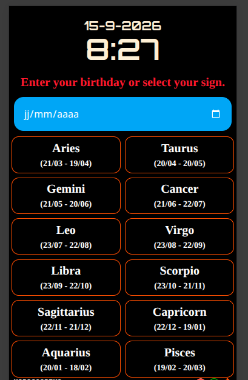

# Horoscopiko

horoscopiko est une application web responsive qui vous donne l'horoscope du jour, de semaines ou de mois selon ce que vous souhaitez, il est à noter que l'affichage est en anglais et tout les données proviennent de l'api `https://freehoroscopeapi.com/`.

# Tech : REACT.JS + TAILWIND CSS V4 avec VITE + FREEHOROCOPEAPI

# Capture de Horoscopiko

ou [visiter le sur Vercel](https://horoscopiko.vercel.app/)

# Architecture du projet

- api/horoscdope.js : configuration de l'api sur vercel
- vite.config.js: l'ajout de `server : {
    proxy:{
      '/horoscope-api': {
        target: 'https://freehoroscopeapi.com',
        changeOrigin: true,
        rewrite: (path) =>
          path.replace(/^\/horoscope-api/, '')
      }
    }
  }` pour qu'il fonctionne en local.

- src/assets : contient tous les fichiers svg du projet, c'est à dire les icônes.
- src/components : contient tous les composants réutilisables de l'application.
    * Buton.jsx: comme son nom l'indique il retourne un bouton
    * Card.jsx: représente le `card` de chaque sign d'horoscope.

- src/layout/Container.jsx: est le composant qui affiche chaque `card` avec les fonctionnaliés qui sont la redirection vers une autre page dédié à ce que l'uilsateur a choisit, par exemple il a cliqué sur le `card Aries`, alors il sera redirigé vers l'horoscope de **Aries**.
- src/layout/ContainerView.jsx: est le composant suivant après le Container.jsx, après le **clic de l'utilisateur**, il sera ici dont il peut cliqué sur `Monthly ou Weekly, Daily es la valeur par défaut`.
- src/layout/Footer.jsx: est le footer de la page
-src/layout/Header.jsx: est l'entête de Horoscopiko dont on voit la **la date et l'heure actuelle**.

- src/pages/Index.jsx : est l'assemblage des composants `Header.jsx,Container.jsx et Footer.jsx` pour qu'il ressemble en une page.
- src/pages/View.jsx : idem comme Index.jsx mais juste le `Container.jsx changé en ContainerView.jsx`.

- src/styles/reset.css : repreésente le style par défaut **des baliles HTML**.

# Obtenir le projet
1)   Cloner le projet.
2)  Installer le dépendance : 
    * cd Horoscopiko
    * npm install (pour installer les dépendaces)
